# Provider Setup — Illustrated Step-by-Step Credential Guide

How to obtain and configure every credential the app **requires at boot** in
production. Companion to `DEPLOYMENT.md` (the Fly.io mechanics). Diagrams
render on GitHub automatically (Mermaid).

## The big picture — where each credential plugs in

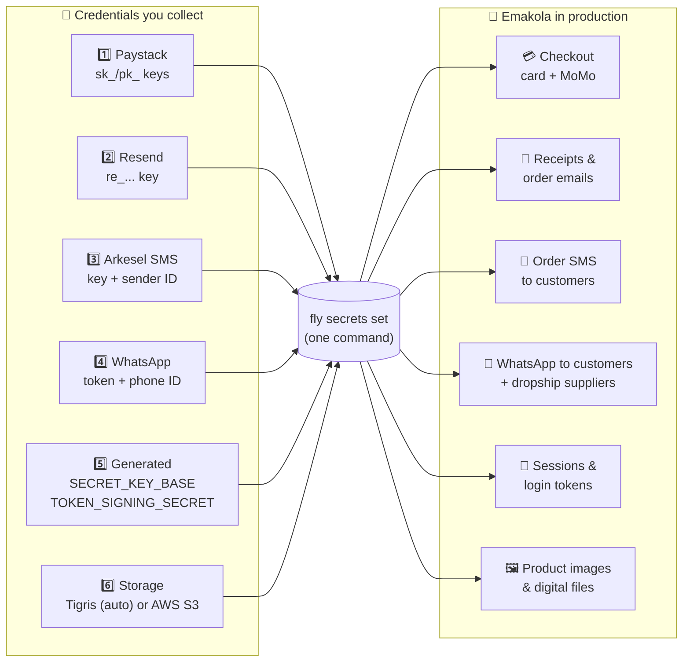

## ⏱️ Do things in THIS order (WhatsApp approval is the long pole)

```mermaid
gantt
    dateFormat  X
    axisFormat Day %d
    section Day 1 — start the slow one first
    Submit WhatsApp templates to Meta     :crit, wa, 0, 1
    Paystack signup + test keys           :ps, 0, 1
    Resend key (+ start DNS verify)       :rs, 0, 1
    Arkesel signup + request Sender ID    :sm, 0, 1
    section Day 2
    Sender ID approved, buy credits       :sm2, 1, 2
    Generate SECRET_KEY_BASE etc.         :gen, 1, 2
    fly launch + postgres + tigris        :fly, 1, 2
    section Day 2–4
    Meta template approval (1–3 days)     :crit, wa2, 1, 4
    section Go-live
    fly secrets set + fly deploy + smoke  :milestone, dep, 4, 4
```

> 💡 You can `fly deploy` **before** WhatsApp templates are approved — sends
> fail gracefully (Oban retries 3×, then discards) while SMS + email work.

---

## 1️⃣ Paystack — payments (cards + MTN MoMo + Vodafone Cash)

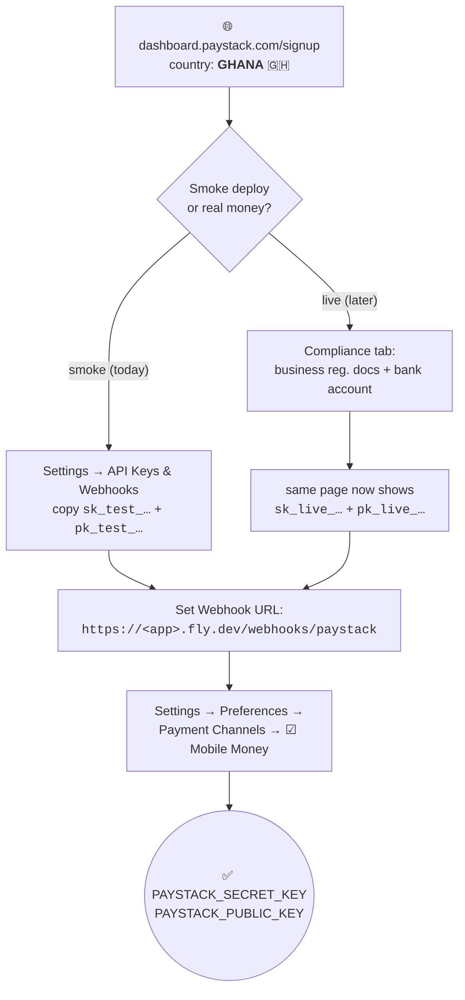

**Dashboard navigation:**

```
Paystack Dashboard
└── ⚙️ Settings
    ├── API Keys & Webhooks      ← keys live here  +  webhook URL field
    │     Secret key  sk_test_xxxxxxxxxxxx   [copy]
    │     Public key  pk_test_xxxxxxxxxxxx   [copy]
    │     Webhook URL [ https://<app>.fly.dev/webhooks/paystack ]
    └── Preferences
          └── Payment Channels   ← ☑ Card  ☑ Mobile Money
```

No extra webhook secret needed — the endpoint verifies Paystack's
HMAC-SHA512 signature using your secret key.

---

## 2️⃣ Resend — transactional email

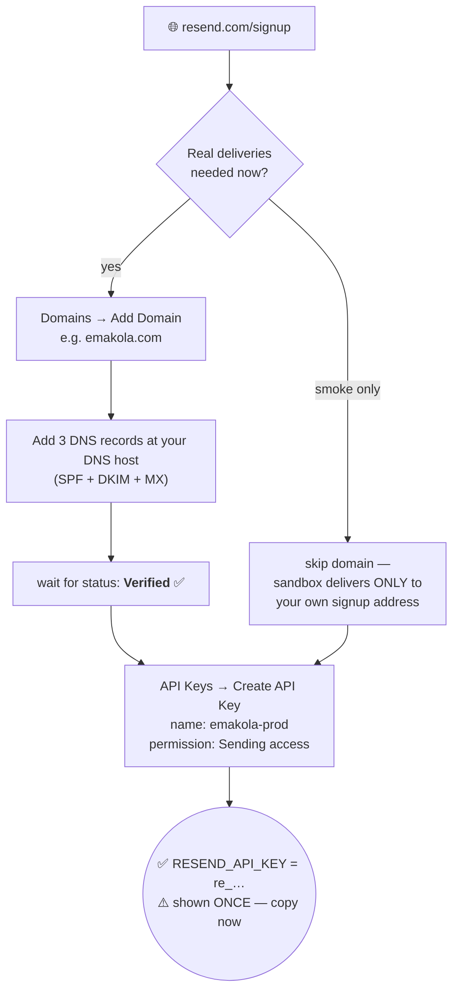

---

## 3️⃣ SMS — Arkesel (or any HTTP gateway)

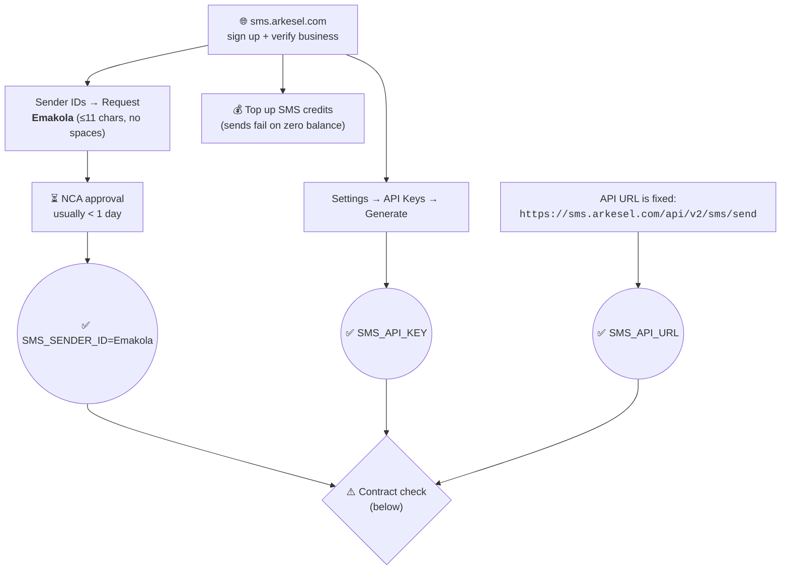

**⚠️ The one compatibility check.** Our channel posts:

```
POST $SMS_API_URL
Authorization: Bearer <SMS_API_KEY>          ← Arkesel v2 expects "api-key" header!
{"to": "+233...", "message": "...", "sender": "Emakola"}
```

Do **one real test send** before launch; if your gateway wants a different
header/body shape, adapt `lib/emakola/notifications/channels/sms.ex` (one
small function).

---

## 4️⃣ WhatsApp Business Cloud API — ⏳ START THIS FIRST

Three credentials AND six approved message templates. Approval: **1–3 days**.

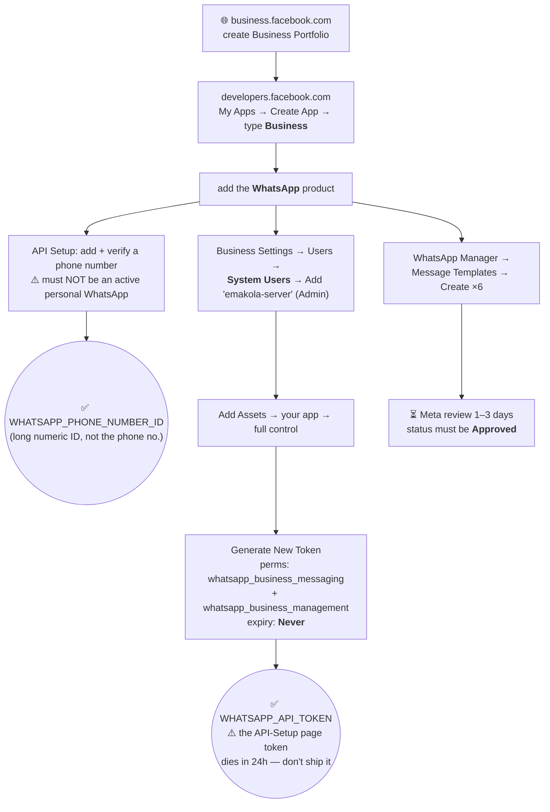

### 4c. The six templates — exact contract with the code

The code (`Emakola.Notifications.Channels.WhatsApp`) sends **positional**
params. Template **names** and **{{n}} order** must match EXACTLY:

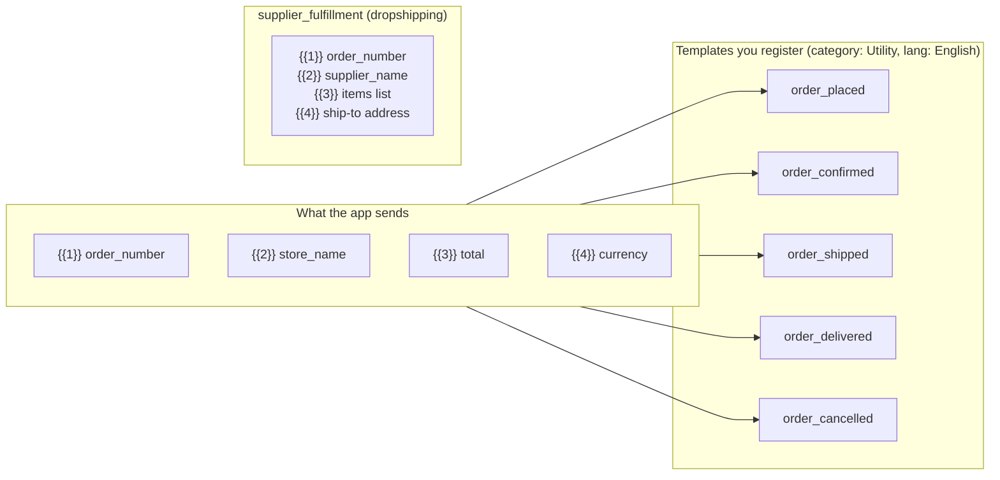

**Copy-paste bodies** (edit tone freely — placeholder ORDER may not change):

| Template | Suggested body |
|---|---|
| `order_placed` | Your order {{1}} at {{2}} has been received. Total: {{4}} {{3}}. We'll confirm shortly. |
| `order_confirmed` | Order {{1}} at {{2}} is confirmed — payment of {{4}} {{3}} received. We're preparing it now. |
| `order_shipped` | Good news! Order {{1}} from {{2}} ({{4}} {{3}}) is on its way. |
| `order_delivered` | Order {{1}} from {{2}} has been delivered. Thank you for shopping with us! |
| `order_cancelled` | Order {{1}} at {{2}} ({{4}} {{3}}) has been cancelled. Contact us with any questions. |
| `supplier_fulfillment` | New order {{1}} for {{2}}. Items: {{3}}. Ship to: {{4}}. Please confirm and share a tracking number. |

### 4d. WhatsApp / phone OTP sign-in (`auth_code` template)

Phone sign-in (WhatsApp/SMS one-time codes) needs **one more template**, in a
different category from the five order templates above:

- **Name:** `auth_code`
- **Category:** **Authentication** (NOT Utility — Meta requires the
  authentication category for one-time passcodes)
- **Language:** English
- **Body:** a single parameter `{{1}}` = the 6-digit code (e.g. `{{1}} is your
  Makola verification code.`). The code (`Emakola.Accounts.PhoneAuth`) sends the
  code as the template's one positional body parameter.

Activation is **ship-dark** behind `PHONE_AUTH_ENABLED`:

- The WhatsApp sign-in button stays hidden until you set
  `PHONE_AUTH_ENABLED=true` (prod reads it from the env var; dev/test are on by
  default).
- You can flip it on **before** the `auth_code` template is approved: delivery
  falls back to **SMS** (your configured SMS provider) and carries the OTP in
  the meantime. Once Meta approves `auth_code`, codes go out over WhatsApp first
  and fall back to SMS only on failure.

---

## 5️⃣ Generated secrets — no signup, 30 seconds

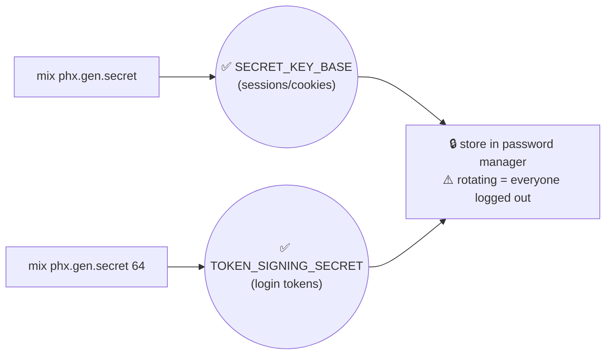

---

## 6️⃣ File storage — Tigris (default) or AWS S3

Product images, digital-download files, and media all go to S3-compatible
storage. Missing storage credentials **warn loudly at boot** (the app still
runs; uploads fail) — so this is required for a real launch but won't block
a smoke deploy.

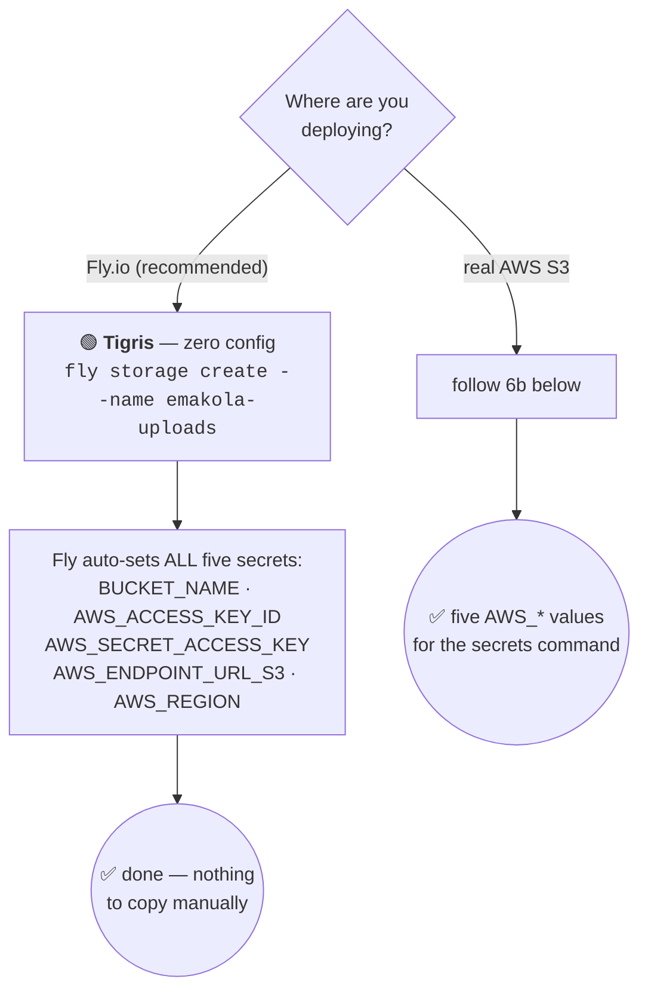

### 6a. Tigris on Fly (zero-config path)

One command — already part of the DEPLOYMENT.md flow:

```bash
fly storage create --name emakola-uploads --region jnb --app <your-app>
```

That's it. All five `AWS_*` secrets are set on the app automatically and the
runtime config parses `AWS_ENDPOINT_URL_S3` so uploads sign against Tigris
(not amazonaws.com). Skip 6b entirely.

### 6b. Real AWS S3 (if you prefer AWS)

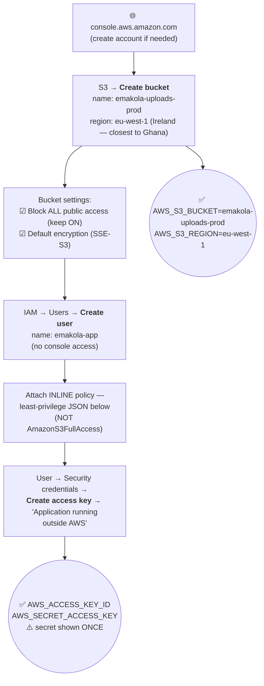

**Step by step:**

1. **Create the bucket** — S3 console → *Create bucket* →
   name `emakola-uploads-prod`, region `eu-west-1` (Ireland — lowest
   latency to West Africa of the major regions). Keep **Block all public
   access ON** (the app serves files via presigned URLs, never public
   objects) and default encryption enabled.
2. **Create a dedicated IAM user** — IAM → Users → *Create user* →
   `emakola-app`, **no** console access.
3. **Attach a least-privilege inline policy** (IAM user → Permissions →
   *Add inline policy* → JSON):

   ```json
   {
     "Version": "2012-10-17",
     "Statement": [
       {
         "Sid": "EmakolaUploads",
         "Effect": "Allow",
         "Action": ["s3:PutObject", "s3:GetObject", "s3:DeleteObject"],
         "Resource": "arn:aws:s3:::emakola-uploads-prod/*"
       },
       {
         "Sid": "EmakolaBucketList",
         "Effect": "Allow",
         "Action": ["s3:ListBucket"],
         "Resource": "arn:aws:s3:::emakola-uploads-prod"
       }
     ]
   }
   ```

4. **Create the access key** — IAM user → *Security credentials* →
   *Create access key* → use case **“Application running outside AWS”** →
   copy both values (the secret is shown **once**).
5. **Collect the five values** for the secrets command:

   | Variable | Value |
   |---|---|
   | `AWS_S3_BUCKET` | `emakola-uploads-prod` |
   | `AWS_S3_REGION` | `eu-west-1` |
   | `AWS_ACCESS_KEY_ID` | `AKIA…` |
   | `AWS_SECRET_ACCESS_KEY` | (shown once) |
   | `AWS_ENDPOINT_URL_S3` | **leave UNSET** — real AWS uses the default endpoint |

> 💸 Cost note: S3 charges for storage + egress; Tigris bundles a global
> CDN and has no egress fees inside Fly — for a Fly deployment, Tigris is
> both simpler AND cheaper. Choose AWS only if you have an existing AWS
> estate or compliance reason.

---

## 7️⃣ Set everything — one command (run it YOURSELF)

`DATABASE_URL` comes from `fly postgres attach`; on the Tigris path (6a)
all `AWS_*` vars are already set. With everything collected:

```bash
fly secrets set \
  SECRET_KEY_BASE="<from mix phx.gen.secret>" \
  TOKEN_SIGNING_SECRET="<from mix phx.gen.secret 64>" \
  DATABASE_SSL="false" \
  RESEND_API_KEY="re_..." \
  PAYSTACK_SECRET_KEY="sk_test_..." \
  PAYSTACK_PUBLIC_KEY="pk_test_..." \
  SMS_API_KEY="..." \
  SMS_SENDER_ID="Emakola" \
  SMS_API_URL="https://sms.arkesel.com/api/v2/sms/send" \
  WHATSAPP_API_TOKEN="EAAG..." \
  WHATSAPP_PHONE_NUMBER_ID="123456789012345" \
  --app <your-app>
```

**If you chose real AWS S3 (6b), append these four lines:**

```bash
  AWS_S3_BUCKET="emakola-uploads-prod" \
  AWS_S3_REGION="eu-west-1" \
  AWS_ACCESS_KEY_ID="AKIA..." \
  AWS_SECRET_ACCESS_KEY="..." \
```

Optional: `HUBTEL_CLIENT_ID`/`HUBTEL_CLIENT_SECRET`/`HUBTEL_WEBHOOK_ALLOWLIST`
(second gateway), `DEMO_MODE=true`, `SENTRY_DSN` (error monitoring — §🔟),
`MAIL_FROM_DOMAIN` + `CONTACT_EMAIL`/`CAREERS_EMAIL`/`PRESS_EMAIL`
(only when your domain isn't `emakola.com` — §9c).

---

## 8️⃣ Verify after `fly deploy`

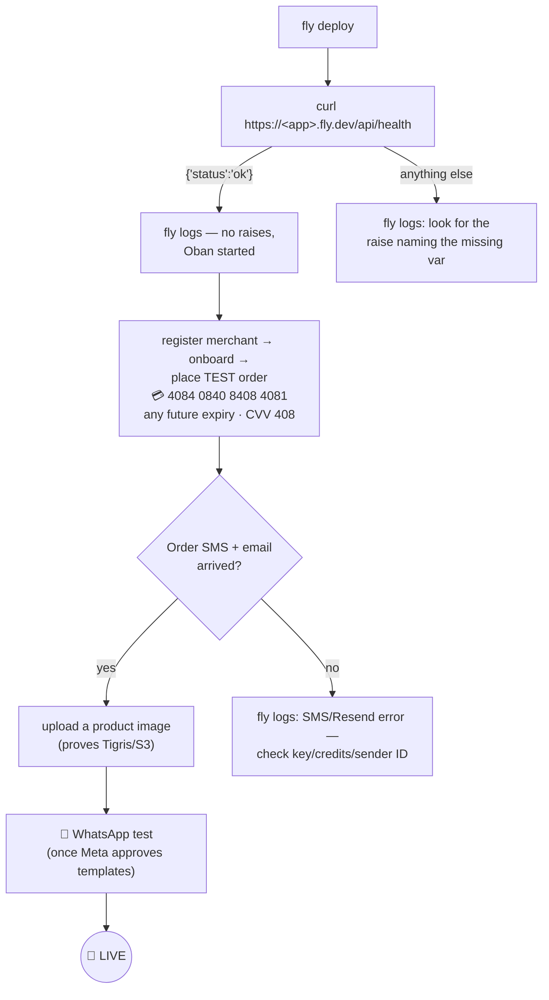

## 9️⃣ Custom domain — DNS + Fly certificates

Optional for the smoke deploy (`emakola.fly.dev` works out of the box);
required for the real launch (your domain + merchant subdomains). Two paths:
**Option A — Namecheap (or any registrar's own DNS)** is the simplest;
**Option B — Cloudflare** adds a CDN + DDoS shield. Use whichever you prefer.

> 🪪 **The same DNS host also holds your email (Resend) records.** Wherever you
> put the records below — Namecheap or Cloudflare — also add the Resend
> **SPF + DKIM** records from §2 there, so email delivery and the website
> share one DNS zone.

### 9a. Option A — Namecheap (registrar DNS)

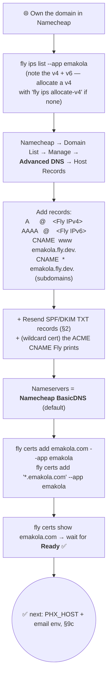

**Step by step (Namecheap):**

1. **Get Fly's IPs** — `fly ips list --app emakola`. The apex (`@`) needs an A
   (IPv4) record, so if there's no dedicated v4, run `fly ips allocate-v4`
   (a shared v4 also works for HTTP).
2. **Namecheap → Domain List → Manage → Advanced DNS → Host Records** — add:

   | Type | Host | Value | TTL |
   |---|---|---|---|
   | `A` | `@` | your Fly **IPv4** | Automatic |
   | `AAAA` | `@` | your Fly **IPv6** | Automatic |
   | `CNAME` | `www` | `emakola.fly.dev.` | Automatic |
   | `CNAME` | `*` | `emakola.fly.dev.` | Automatic (merchant subdomains) |

   Then add the **Resend SPF + DKIM** records from §2 in this same list.
   Keep **Nameservers = Namecheap BasicDNS** (the default).
3. **Issue Fly certs** — `fly certs add emakola.com --app emakola` and
   `fly certs add '*.emakola.com' --app emakola`. The wildcard cert needs an
   **ACME DNS-challenge `CNAME`** — `fly certs show` prints it; paste that into
   Namecheap Advanced DNS too. Re-run `fly certs show` until both say **Ready**.
4. Continue at **§9c** (PHX_HOST + email env).

### 9b. Option B — Cloudflare (adds CDN + DDoS)

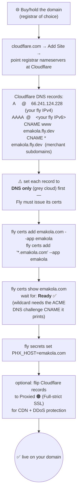

### 9c. Point the app at the domain (+ flip email) — pure config, no code

Once certs are **Ready**, the entire app + email domain swap is env only:

```bash
# Receiving/sending email addresses follow the domain. MAIL_FROM_DOMAIN
# drives every mailer's "from" (noreply@/billing@).
fly secrets set \
  MAIL_FROM_DOMAIN=emakola.com \
  CONTACT_EMAIL=support@emakola.com \
  CAREERS_EMAIL=careers@emakola.com \
  PRESS_EMAIL=press@emakola.com \
  --app emakola
```

Then set the canonical host in **`fly.toml`** under `[env]` and redeploy:

```toml
[env]
  PHX_HOST = "emakola.com"   # drives URL generation AND check_origin
```

Notes:
- `PHX_HOST` flows into `url` **and** `check_origin` (it auto-allows
  `https://PHX_HOST`, `www.`, and the `*.PHX_HOST` wildcard for merchant
  subdomains) — **no code change**. Keep `https://emakola.fly.dev` in the
  allowlist during the cutover.
- **Switching to a different domain (e.g. `emakola.io`)?** Same commands —
  just substitute the domain in the env vars and `PHX_HOST`. The sending
  domain lives in one config (`:mail_from_domain`); nothing is hardcoded.
- Until DNS is done, everything works on `https://emakola.fly.dev`.

### 9d. Store subdomains — pretty storefront URLs (`tiny-stitches.makola.io`)

Every store's storefront serves at `<slug>.<base>` (e.g. `tiny-stitches.makola.io/cart`)
with the branded host kept in the address bar; the indexed canonical stays the apex
subfolder (`makola.io/s/<slug>`), so SEO authority stays consolidated. **Ships dark** —
nothing changes until the three steps below. No per-store provisioning or backfill is
needed: `<slug>.<base>` resolves implicitly (reserved labels like `www`/`admin`/`api`
are never served).

```bash
# 1. Wildcard TLS for every store subdomain
fly certs add '*.makola.io' --app emakola

# 2. Turn the feature on (the apex base; storefront hosts are <slug>.<base>)
fly secrets set STORE_SUBDOMAIN_BASE=makola.io --app emakola
```

3. **Wildcard DNS** at the registrar — add `*.makola.io` pointing at the **same**
   Fly IPs as the apex (Namecheap: `A`/`AAAA` records for host `*` mirroring section 9a).
   `fly certs show '*.makola.io'` lists exactly what's needed.

Notes:
- `check_origin` already allows the `*.PHX_HOST` wildcard (section 9c) — no code change.
- Custom vanity labels (a merchant claiming `ama-kitchen.makola.io` instead of their
  slug) and full custom domains are explicit `StoreDomain` records managed from the
  merchant's **Storefront address** settings; those take precedence over the implicit slug.

---

## 🔟 Sentry — error monitoring (optional, recommended)

The app ships with Sentry wired into Phoenix / LiveView / Oban. It stays
**completely inert until you provide a DSN** — no DSN means `capture` returns
`:ignored`, so there's nothing to break.

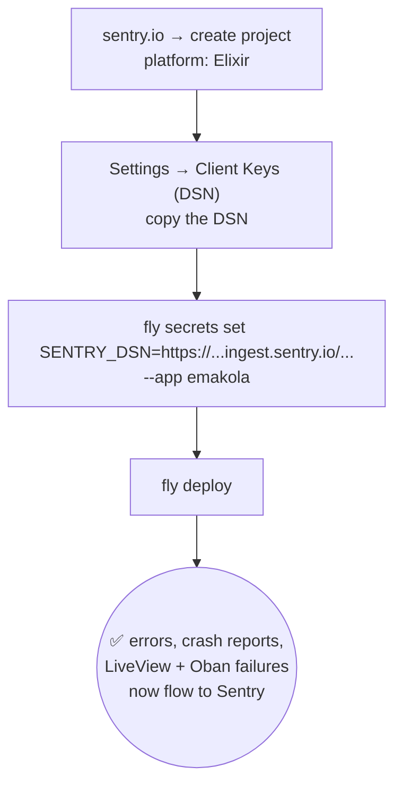

- Env var: **`SENTRY_DSN`** (optional `SENTRY_RELEASE`). The DSN is *not* a
  secret (it only says where to send events) — using `fly secrets` just keeps
  it out of the repo.
- Uses the existing **Finch** HTTP client (no hackney added).
- Smoke test after the DSN is set: trigger any error and confirm it appears in
  the Sentry dashboard within a minute.

---

## 👤 First platform admin (owner)

Platform staff sign in at **`/platform/login`** (password **+** mandatory TOTP)
and are normally created by **invite** from the Team page. To create the very
first owner out-of-band (e.g. right after launch, before email works), open a
console on the live node:

```bash
fly ssh console -C "/app/bin/emakola remote" --app emakola
```

Then paste (edit the two values at the top). **Exit with Ctrl+C twice — never
`System.halt`.**

```elixir
require Ash.Query

email    = "owner@yourdomain.com"
password = "PickAStrongPassword"

Emakola.Accounts.User
|> Ash.Changeset.for_create(:bootstrap_owner, %{email: email, password: password})
|> Ash.create!(authorize?: false)
```

Then log in at `/platform/login` and set up TOTP.

- **Scoped (non-owner) admin instead?** Use the `:accept_platform_invite`
  action with `platform_permissions:` from this set:
  `:manage_stores`, `:manage_merchants`, `:manage_team`, `:view_audit_log`,
  `:manage_billing`, `:manage_settings`. Owner (`is_owner: true`) bypasses all
  checks.
- Local dev has the convenience task: `mix emakola.bootstrap_platform_owner <email>`.

---

## 🚫 Integrations you do NOT need to set up

So you don't chase credentials nothing consumes:

| Integration | Status | Why no setup |
|---|---|---|
| **Stripe** | ❌ Not wired | No Stripe SDK dependency, **no `/webhooks/stripe` route**, no `STRIPE_*` env var read anywhere. The `stripe_*` fields on Billing resources and the `StripeHandler` worker are dormant scaffolding for a future merchant-subscription feature; the Stripe mentions on the `/docs` page are leftover boilerplate copy. Customer payments run on **Paystack/Hubtel** (§1). |
| **Mailgun** | ❌ Not wired | Only a commented-out example in `runtime.exs`; email runs on **Resend** (§2). |
| **Sentry** | ✅ Wired, optional | Now a dependency and fully integrated — but **inert without `SENTRY_DSN`**. Set the DSN to turn it on (see §🔟); nothing breaks if you don't. |
| **Chrome/PDF** | ✅ Built into the image | Receipt/report PDFs use ChromicPDF; Chromium ships in the Docker image and spawns on-demand — zero setup, no env vars. |

> If/when merchant subscription billing launches for real, Stripe gets its own
> section here — account → API keys → webhook endpoint + `STRIPE_WEBHOOK_SECRET`.
> Today that would document a fiction.

---

## ✅ Master checklist

- [ ] **Day 1:** WhatsApp templates submitted to Meta (the 1–3 day item)
- [ ] Paystack: account ▸ test keys ▸ webhook URL ▸ MoMo channel on
- [ ] Resend: API key (+ domain DNS verified for real delivery)
- [ ] Arkesel: Sender ID approved ▸ API key ▸ credits topped up ▸ contract test-send
- [ ] WhatsApp: permanent System-User token ▸ phone number ID
- [ ] `SECRET_KEY_BASE` / `TOKEN_SIGNING_SECRET` generated & stored
- [ ] Storage: Tigris `fly storage create` (6a) — or AWS bucket + IAM user + key (6b)
- [ ] Infra: `fly launch` ▸ postgres (+`DATABASE_SSL=false`) (DEPLOYMENT.md)
- [ ] Section 7 `fly secrets set`
- [ ] `fly deploy` ▸ section 8 smoke flow green
- [ ] Custom domain: Namecheap **or** Cloudflare DNS ▸ `fly certs` Ready ▸ `PHX_HOST` + email env updated (§9 — post-smoke)
- [ ] First platform owner bootstrapped ▸ logged in ▸ TOTP set (§👤)
- [ ] _(optional)_ `SENTRY_DSN` set for error monitoring (§🔟)
